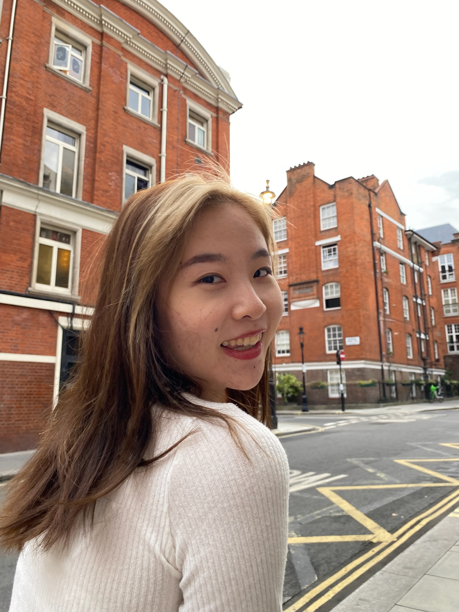

# 👋 Hi, I'm Qianyi!

  

🚀 UX/UI Designer | Frontend Developer | Researcher  
🌍 Based in Toronto, Canada  
💡 Passionate about user-centered design and intuitive digital experiences  

---

## 🔗 Connect with Me
📷 **GitHub:** [github.com/yourusername](https://github.com/Elliedd-26)  
💼 **LinkedIn:** [linkedin.com/in/yourprofile](https://www.linkedin.com/in/ellie-dong/)  
🎨 **Portfolio:**[elliedong.com/in/yourprofile](https://framer.com/projects/Ellie-portfolio--103Dy0CJWrwkV5ePjYCe-dl7L9?node=SEjQ8MFjl/)

---
## 🎨💻 Skills  

### 🎨 Designer Skills  
- **UX/UI Design** – Wireframing, Prototyping, User Testing  
- **Design Tools** – Figma, Adobe XD, Photoshop, Illustrator  
- **User Research** – Personas, Heuristic Evaluations, Usability Testing  
- **Branding & Visual Identity**  

### 💻 Developer Skills  
- **Frontend Development** – HTML, CSS, JavaScript, React  
- **Web Design** – Responsive Design, Accessibility  
- **Basic Programming** – Python, C#  
- **Version Control** – Git, GitHub  

---
### 🚀 **Let’s Connect & Build Something Amazing!**
